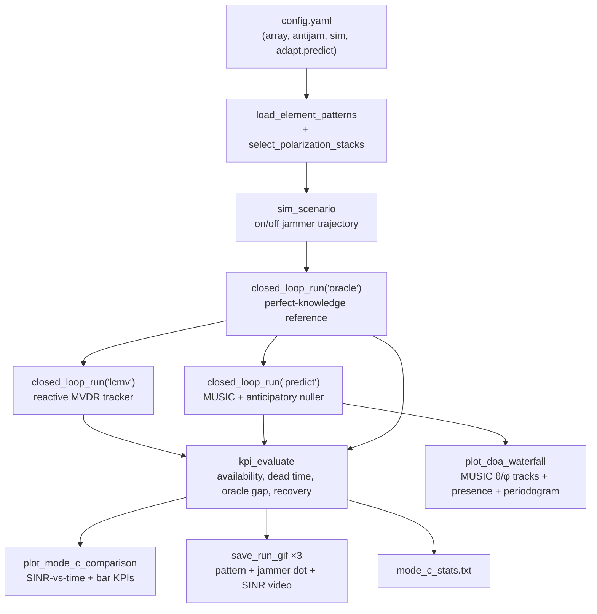

# Mode C demo — what `run_mode_c_demo_script.m` does and why

This document explains the anti-jam **Mode C** demo (`MATLAB/scripts/run_mode_c_demo_script.m`,
milestone phase [P8]): the pipeline it runs, the reasoning behind the design, the
signal-processing concepts it implements (MVDR/LCMV, MUSIC), and where to look next to
push performance further. It is a companion read to `antijam_milestone_plan.md` (the plan
of record) and `docs/notes.md` (session log) — this doc is the "why does this exist and how
does it work" reference; those two remain authoritative for status and history.

## 1. What problem this demo is solving

The array must keep a radiation peak toward a desired direction θ_s while a single,
unknown jammer at (θ_j, φ_j) turns on and off. "Mode C" means the receiver has access to
**per-element snapshots** (an `N_el × K` complex matrix each timestep), so it can estimate
the spatial covariance `R` and run classical covariance-based beamforming — as opposed to
"Mode S", where only a scalar SINR is observed (see `adapt_spsa_*` / `agent_bandit_*`, not
used in this demo).

The specific scenario the demo runs is an **on/off jammer**: 5 s ON / 5 s OFF, repeating,
for 40 s. This is deliberately the case that separates a purely *reactive* algorithm from
a *predictive* one — see §3.

## 2. Pipeline (what the script does, in order)



Step by step:

1. **Config + array** — reuses `config.yaml` (`antijam`, `sim`, `adapt` sections) so the
   demo tracks the same array geometry, polarization, forgetting factor, and diagonal
   loading used by the rest of the milestone. Element patterns are loaded once
   (`load_element_patterns`) and split into co-pol/cross-pol (or total) stacks.
2. **Scenario** — `sim_scenario` builds a fixed on/off trajectory: jammer at
   `(θ_j=25°, φ_j=150°)`, 50% duty cycle, 10 s toggle period, J/N = 1 dB above the noise
   floor, 40 s total (`scn_cfg` in the script — edit these fields to try other jammer
   behavior, e.g. drift).
3. **Oracle reference** — `closed_loop_run('oracle', ...)` is run *first* because every
   other method's SINR is scored against it. The oracle builds `R` analytically from the
   **true** jammer angle (`sim_analytic_covariance`) each step — information no real
   algorithm may see — and applies the MVDR solution. This is the upper bound.
4. **Each Mode C method** (`oracle`, `lcmv`, `predict`) is run through the same closed
   loop (`closed_loop_run`), scored (`kpi_evaluate` — availability, dead time, recovery,
   oracle gap, DoA-RMSE for `predict`), and rendered as an animated video
   (`save_run_gif`: live 2-D pattern, jammer position, SINR trace).
5. **Comparison figure** (`plot_mode_c_comparison`) — one plot: SINR-vs-time for all three
   methods plus the threshold line and gray "jammer ON" shading, plus three bar charts
   (availability %, dead time s, mean oracle gap dB). The notches at each jammer turn-on
   are exactly where the methods diverge.
6. **Statistics table** (`mode_c_stats.txt`) — the same numbers, printed and saved.
7. **DoA diagnostics** (`plot_doa_waterfall`) — a 4-panel figure specific to `predict`,
   showing *how* it works: MUSIC's θ and φ estimates vs ground truth, the presence
   timeline (true ON vs MUSIC-detected vs predicted), and the periodogram that recovers
   the 10 s toggle period.

Everything lands in `results/mode_c_demo/<timestamp>/`.

## 3. The reasoning: why three methods, why this scenario

| Method | What it sees | Behavior | Role |
|---|---|---|---|
| `oracle` | True θ_j (cheats) | Recomputes the analytically-optimal MVDR null every step | Upper bound — nothing can beat this |
| `lcmv` | Snapshots only | Estimates `R̂` with exponential forgetting, recomputes MVDR every step | Reactive baseline (milestone P2) |
| `predict` | Snapshots only | Runs MUSIC on `R̂` to get an explicit jammer angle, learns the on/off period, **pre-forms** the null before the jammer returns | Anticipatory method (milestone P8, this demo's subject) |

The reactive tracker (`lcmv`) has a structural weakness: its covariance memory decays with
time constant `~1/(1-λ)` steps (λ = `forgetting_lambda` = 0.98 → ~50 steps ≈ 2.5 s at the
demo's step rate). Across a 5 s OFF gap, that memory has fully decayed, so when the jammer
turns back on, `lcmv` has to **re-learn** the null from scratch — a real SINR dip
("dead time") every cycle. An on/off jammer with a gap longer than the forgetting horizon is
precisely the case that exposes this, which is why the demo scenario is built that way
rather than, say, a continuously-present jammer (where `lcmv` and `predict` would look
identical — see the `predict`≡`lcmv` invariant on scenario S1 in the milestone plan).

`predict` exploits the fact that the jammer's on/off behavior is **temporally predictable**:
once the period is learned, the null can be re-formed *before* the jammer returns, so there
is no re-acquisition lag at turn-on. The measured result on this demo scenario (from the
milestone plan, [P8]): dead time 0.30 s (`predict`) vs 0.70 s (`lcmv`), availability 99.7%
vs 99.3%, oracle gap 0.60 dB vs 0.78 dB, recovery 0.30 vs 1.22 steps.

## 4. Concepts implemented

### 4.1 MVDR / LCMV (Minimum-Variance-Distortionless-Response / Linearly-Constrained
Minimum-Variance)

**What it is.** A beamformer that picks weights `w` to minimize output power
(`min wᴴRw`) subject to a hard linear constraint that the response toward the desired
direction stays unity (`wᴴe_s = 1`). The closed-form solution is

```
w = R⁻¹e_s / (e_sᴴ R⁻¹ e_s)
```

Intuitively: it keeps the desired signal undistorted while placing as little energy as
possible everywhere else — which, if a jammer dominates `R`, means an automatic deep null
toward it. No jammer angle is ever named explicitly; the null falls out of minimizing
against measured (or true) interference-plus-noise statistics. This is implemented in
[`adapt_lcmv.m`](../MATLAB/antijam_utils/adapt_lcmv.m).

**LCMV** generalizes this to *multiple* linear constraints — e.g. "unity response at θ_s
**and** exactly zero response at θ_j" — via constraint matrix `C = [e_s, e_null]` and
response vector `g = [1; 0]`:

```
w = R⁻¹C (Cᴴ R⁻¹ C)⁻¹ g
```

The key property the `predict` algorithm relies on: the null in LCMV is a **deterministic
constraint on w**, independent of `R`. That means you can force a null toward a direction
that currently carries *no energy at all* (a quiescent `R = I`) — i.e., pre-form a null
before the jammer is even on. This is
[`adapt_lcmv_null.m`](../MATLAB/antijam_utils/adapt_lcmv_null.m); it reduces exactly to
plain MVDR when `e_null = []`.

*(Total-polarization note: when the desired signal spans 2 components (co-pol + cross-pol),
forcing unity response on both over-constrains the array — the fix is
[`adapt_maxsinr.m`](../MATLAB/antijam_utils/adapt_maxsinr.m), a rank-2 max-SINR
generalized-eigenvector solution that both `adapt_lcmv` and `adapt_lcmv_null` delegate to.)*

**Reactive tracking** (`lcmv` in this demo) applies MVDR to an **estimated** covariance
with exponential forgetting: `R̂(t) = λR̂(t-1) + (1-λ)x(t)x(t)ᴴ`, recomputed every step
(`adapt_tracking_update`). This is the standard **sample matrix inversion (SMI)** adaptive
array — no explicit angle is ever estimated; the null "follows the data."

### 4.2 MUSIC (MUltiple SIgnal Classification)

**What it is.** A subspace-based direction-of-arrival (DoA) estimator. Eigendecompose the
covariance `R̂`: the top eigenvalues/eigenvectors span the "signal-plus-jammer" subspace
(here fixed at dimension 2, since scope is 1 desired signal + 1 jammer), and the rest span
the orthogonal "noise subspace" `E_n`. Because true source steering vectors are (by
construction) orthogonal to the noise subspace, scanning a pseudospectrum over candidate
angles and looking for where the steering vector `a(θ,φ)` is *most* orthogonal to `E_n`
recovers the source directions:

```
P_MUSIC(θ,φ) = ‖a(θ,φ)‖² / ‖E_nᴴ a(θ,φ)‖²
```

(The `‖a‖²` numerator is a project-specific correction — see
[`adapt_music_doa.m`](../MATLAB/antijam_utils/adapt_music_doa.m): measured embedded-element
patterns have column norms that vary strongly across the grid, unlike a ULA's constant
`√N`, so the unnormalized metric spuriously peaks at low-norm endfire-like directions.)

Unlike MVDR/LCMV, MUSIC produces an **explicit angle estimate** — this is what lets
`predict` know *where* to aim a pre-formed null. Jammer *presence* (as opposed to angle) is
decided separately, from the **eigengap**: the jammer's eigenvalue collapses toward the
noise floor when it's off, so a large gap above a configured threshold (`presence_gap_db`)
means "jammer is here."

### 4.3 Predictive / anticipatory nulling (the new part, [P8])

`adapt_predict_update` combines the two: each step it (1) folds the new snapshots into
`R̂` (same forgetting as `lcmv`), (2) runs MUSIC to get an angle + presence flag, (3) pushes
presence into a ring buffer and runs an FFT-based periodogram on it once enough cycles have
been observed, to learn the toggle period and a sub-bin-interpolated phase, and (4) decides
whether the jammer is expected on within `lead_steps`. The beamformer then chooses:

- jammer **currently visible** → reactive MVDR null from `R̂` (identical to `lcmv` — this
  design choice makes `predict` provably never worse than `lcmv` while the jammer is
  actually on, and avoids mis-steering on a noisy transient MUSIC estimate);
- jammer **absent but predicted back within `lead_steps`** → hard LCMV null at the
  **last-known** angle, built from a quiescent `R = I` (pre-forming the null before energy
  returns);
- jammer **absent, not predicted soon** → plain distortionless MVDR (full quiescent gain
  restored).

This is a **periodicity/persistence predictor**, not a full state-space (position + velocity)
tracker — it exploits *timing* predictability (when will it come back), not *spatial*
predictability (where will it be if it's drifting). That's a deliberate scope choice (see §5).

## 5. Known limitations / what this demo does NOT show

- **Static angle only.** The demo scenario's jammer sits at a fixed (θ_j, φ_j) — only its
  power toggles. If the jammer also **drifts** during the OFF gap, "hold the last-known
  angle" (what `predict` does today) goes stale by `drift-rate × off-duration`. This is
  explicitly called out in the milestone plan as the open follow-up (a CV-Kalman drift
  predictor on the same substrate, targeting scenarios S2/S3).
- **Single ON burst has no period to learn** (relevant to lifecycle-style scenarios): the
  periodogram needs several cycles before it "trusts" a detected period; a lone burst falls
  back to "persist last predicted null," not genuine period learning.
- **Single jammer, fixed model order 2.** MUSIC's subspace split is hardcoded to one
  desired signal + one jammer — this is a locked scope decision (see
  `antijam_milestone_plan.md` §1), not a MUSIC limitation per se.
- The demo is a **single scenario, single seed** — a qualitative/visual comparison, not the
  statistical evaluation. For confidence intervals you need the full Monte Carlo campaign
  (`run_antijam`, §6 below).

## 6. How to test "how good are we doing" — benchmarks and next steps

### 6.1 Benchmarks already built into this codebase

These are the most directly comparable numbers, since they run on the *same* simulation
engine and scenario suite:

- **Oracle gap** (dB) — the honest ceiling. `predict`/`lcmv` are compared to the
  perfect-knowledge LCMV, not to an arbitrary reference. A gap near 0 dB means "as good as
  knowing the truth."
- **The milestone's 5 KPIs** (`kpi_evaluate.m`): SINR availability, recovery time,
  null-pointing error, peak-gain penalty, oracle gap — see `antijam_milestone_plan.md` §5.
- **The standard scenario suite S1–S6** (static, drift, drift+jump, power-step, on/off+drift,
  lifecycle) — `run_antijam` runs all algorithms × all scenarios × multiple seeds and
  produces the full KPI table. This demo only exercises one on/off scenario at one seed;
  running the full suite is the natural next step to get statistically defensible numbers
  (flagged as not-yet-re-run under the current 2-D geometry in plan §4, P7/P8 notes).
- **`predict` ≡ `lcmv` invariant on S1** (always-on jammer) — a built-in sanity/regression
  check: if there's no periodicity to exploit, `predict` must not do *worse* than the
  reactive baseline.

### 6.2 Classical adaptive-beamforming / DoA literature (external benchmarks)

Where this demo's approach sits relative to the wider field, if you want to argue "good
enough" against established methods:

- **Capon / MVDR (Capon, 1969)** — what `adapt_lcmv` already implements; the standard
  reference beamformer this project already benchmarks against via the oracle.
- **GSC (Generalized Sidelobe Canceller, Griffiths & Jim, 1982)** — an equivalent
  unconstrained reformulation of LCMV; behaviorally the same optimum, different numerical
  path. Not needed here (direct LCMV is fine at this array size) but a common reference
  point in surveys.
- **Applebaum / Frost adaptive arrays** — the classical *gradient-based* (LMS-style)
  adaptive nuller, predating SMI covariance estimation. Slower convergence than the SMI
  tracker used here, but simpler/cheaper — a natural baseline if you ever need a
  low-compute fallback.
- **Subspace tracking (PASTd, or other recursive-eigendecomposition methods)** — this
  demo recomputes a *full* eigendecomposition of `R̂` every step for MUSIC. For larger
  arrays or higher update rates, a recursive subspace tracker would avoid the `O(N_el³)`
  eigendecomposition cost — worth benchmarking runtime against if array size grows.
- **Kalman-filter DoA tracking** — the standard classical answer to "the source is moving
  predictably": maintain a state (angle, angular velocity) and a process model, predict
  forward, correct with each MUSIC (or other) measurement. This is exactly the deferred
  CV-Kalman follow-up in the milestone plan for S2/S3 — the natural benchmark for "how much
  better could we do on drift" once implemented.
- **Particle filters / IMM (interacting multiple model)** for maneuvering-source tracking —
  a heavier-weight alternative to Kalman if the jammer's motion model is itself uncertain
  (e.g., switches between static and drifting) — worth naming as a stretch benchmark, not
  a near-term implementation target.

### 6.3 Modern / learning-based approaches (context, not in scope)

- **Deep-learning DoA estimation** (CNN/RNN-based super-resolution DoA, e.g. learning a
  pseudospectrum end-to-end) and **learned beamformers** (neural weight prediction from
  snapshots) are active research directions that can outperform MUSIC in low-snapshot /
  low-SNR / coherent-source regimes where the subspace split degrades. They are **out of
  scope** for this milestone by design — `CLAUDE.md` and the milestone plan restrict this
  work to classical methods (no neural networks; R2020a base MATLAB only, no toolboxes) —
  but worth naming if the customer asks "why not use ML here": the honest answer is
  scope/compute/compatibility constraints, not that classical methods are known to be worse
  at this problem size (single jammer, high enough SNR, MATLAB-only deployment target).
- **RL-based cognitive radar/jamming response** (treating null-placement as a
  sequential-decision problem) — conceptually closer to the Mode S bandit approach already
  in this codebase (`agent_bandit_*`) than to Mode C; if a benchmark is wanted here, compare
  against the existing bandit's recovery-time numbers rather than introducing new RL.

### 6.4 Suggested concrete next steps, in priority order

1. **Re-run and re-tune the full P1–P6 Monte Carlo campaign** under the current 2-D
   geometry — the quantitative KPI numbers quoted in the milestone plan predate the P7
   (native 2-D) and some P8 changes and are flagged stale. This is the highest-value next
   step for trusting any "how good are we" claim beyond this one demo scenario.
2. **Implement the CV-Kalman drift predictor** (P8's own identified follow-up) and re-run
   S2/S3/S5 — this directly targets the one scenario class `predict` does not yet close
   (drift *during* the OFF gap).
3. **Add a DoA-RMSE benchmark against a Kalman baseline** once (2) exists — quantifies
   "how much did prediction actually buy us" beyond "hold last-known angle."
4. **Stress-test MUSIC's model-order-2 assumption** — add a scenario with a second,
   lower-power interferer, and confirm (or characterize the failure of) presence detection
   and angle estimation degrading gracefully rather than silently.
